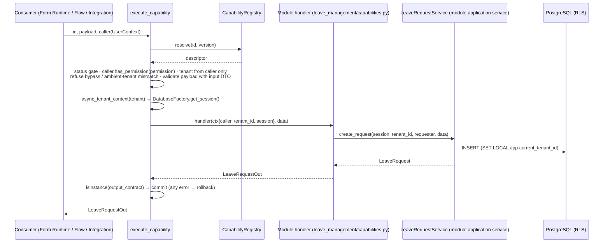
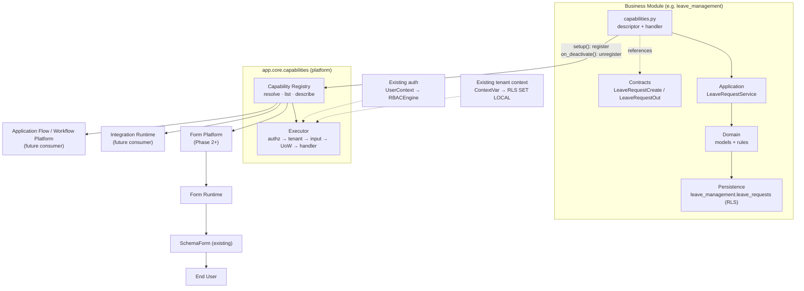

# Capability Platform

**Introduced by:** Form Platform Phase 1 — Capability Contract & Registry Foundation (2026-10-05)
**Code:** `backend/app/core/capabilities/`
**First real capability:** `leave_management.leave_request.create` v1 (`backend/external_modules/leave_management/capabilities.py`)
**Audit / readiness:** `reviews/FORM_CAPABILITY_FOUNDATION_AUDIT.md`, `reviews/FORM_CAPABILITY_FOUNDATION_READINESS.md`

> A Form is an input mechanism, not the authority over business behavior.
> The Capability Contract is the bridge between configurable ERP experiences and authoritative business logic.

---

## 1. What is a Capability?

A **capability** is a stable, versioned **business operation** that a business module publishes. Examples: *create a leave request*, *confirm a sales order*, *post a journal entry*.

A capability is identified by **what it does in business terms**, not by how it is built:

| ✅ Capability id | ❌ Not a capability id |
|---|---|
| `leave_management.leave_request.create` | `LeaveRequestService.create_request` (class + method) |
| | `POST /api/v1/leave-management/requests` (route) |
| | `leave_management.leave_requests` (table) |

### 1.1 Naming convention

```text
<module>.<resource>.<action>
```

- Every segment is lower-snake-case (`^[a-z][a-z0-9_]*$`). There are exactly three segments.
- **`<module>` is the owning module's registered name** (`leave_management`, `sales`, `accounting`). The registry enforces this, so a module can only publish into its own namespace. The brief's `employee.leave.create` is illustrative. The real id uses the module that owns the behaviour.
- `<resource>` is the business object, in the singular (`leave_request`, `sales_order`, `journal_entry`).
- `<action>` is the business verb (`create`, `submit`, `approve`, `cancel`, `post`, …), never a technical one (`insert`, `save`, `execute`).
- Ids are **permanent**. A rename is a new capability, and the old one is deprecated.

---

## 2. Capability Contract: what a capability exposes

`CapabilityDescriptor` (`app/core/capabilities/contract.py`):

| Field | Meaning |
|---|---|
| `id`, `version` | Registry key. `version` is an int ≥ 1. The display form is `<id>:v<version>`. |
| `module`, `resource`, `action` | Derived from `id`, so they can never disagree with it. |
| `display_name`, `description` | Business-language metadata for discovery UIs. |
| `input_contract` / `output_contract` | The **owning module's canonical Pydantic DTOs**, referenced by type. The capability layer never defines a DTO. |
| `permission` | An **existing** permission code from the owning module's manifest, which must be in the module's namespace. |
| `tenant_scoped` | `True` (default) means a tenant context is required. |
| `status` | `active` / `deprecated` / `disabled` (§4). |

`descriptor.describe()` is the **only view a consumer gets**. It is plain JSON:

```json
{
  "id": "leave_management.leave_request.create", "version": 1, "key": "leave_management.leave_request.create:v1",
  "module": "leave_management", "resource": "leave_request", "action": "create",
  "display_name": "Create leave request",
  "description": "Create a draft leave request for the calling employee. …",
  "input":  {"contract": "LeaveRequestCreate", "schema": { …JSON Schema… }},
  "output": {"contract": "LeaveRequestOut",    "schema": { …JSON Schema… }},
  "permission": "leave_management.requests.write",
  "tenant": {"required": true},
  "status": "active"
}
```

`describe()` never contains a handler, a Python class or module path, a route, a table or an ORM detail (`tests/unit/test_capability_registry.py::test_describe_is_plain_json_with_schemas_and_no_implementation_details`). The contract `name` is the DTO's published JSON Schema title, which is the canonical contract name.

**Registration-time guarantees:** the id grammar holds, the version is a positive int, the permission is in the owner's namespace, both contracts are Pydantic models whose JSON Schema generates, the **input contract declares no `tenant_id`**, and the handler is `async`.

---

## 3. Registry: how a capability is discovered

`app/core/capabilities/registry.py`, process-global `capability_registry`:

```python
capability_registry.list_capabilities(module=None, include_disabled=False)  # sorted by (id, version)
capability_registry.resolve(capability_id, version=None)                    # → CapabilityDescriptor
capability_registry.get_descriptor(capability_id, version=None)             # alias of resolve
capability_registry.describe(capability_id, version=None)                   # → plain JSON metadata
```

- **It is not a service locator.** None of the public read methods returns a handler. A handler is reachable **only** through the executor, which applies the security chain first.
- **Lookups are plain dict lookups** on keys that only trusted module `setup()` code can create. There is no `getattr` / `eval` / `exec` / `importlib.import_module`, and an AST/source test guards this.
- **Lifecycle:** the module registers in `setup()` (which runs on every activation) and unregisters in `on_deactivate()`. Deactivation withdraws a module's capabilities immediately; this is proven against real PostgreSQL. If the owner re-registers the same `(id, version)`, the entry is replaced (idempotent re-activation). Any other module is rejected.
- **Phase 1 discovery is in-process only.** There is no HTTP discovery endpoint yet; it belongs to the phase that has a real UI consumer.

---

## 4. Versioning

| Rule | |
|---|---|
| Identity | The key is `(id, version)`, e.g. `leave_management.leave_request.create:v1`. |
| Default resolution | `resolve(id)` returns the **highest `active` version**. `deprecated` and `disabled` versions are never chosen implicitly. |
| Explicit resolution | `resolve(id, version=n)` returns exactly that version. `deprecated` versions **remain executable** when requested explicitly. `disabled` versions resolve for inspection but are **never executable**. |
| Compatible change | Adding an optional input field or an output field keeps the same version (the DTO stays backward compatible). |
| Breaking change | Removing or renaming a field, adding a required input, or changing semantics means a **new version** with its own DTOs. The previous version moves to `deprecated` (still executable for pinned consumers such as stored form definitions), then to `disabled`, then is removed. |
| Contract versions | DTOs are not versioned separately. **The capability version pins its input and output contracts.** |

Phase 1 implements exactly the above, with no migration tooling. Version management infrastructure waits until a second version actually exists.

---

## 5. Execution: how a capability reaches the application service

```python
from app.core.capabilities import execute_capability
result = await execute_capability("leave_management.leave_request.create", payload, caller=user)
```



- The **handler** is module-owned, trusted code. It does what the HTTP route does, minus HTTP: it calls the module's own service with tenant and actor from `ctx`. It **never commits**; the executor owns the unit of work, one capability execution per transaction. The service still only `flush()`es, exactly as it does under the route.
- **Business rules stay in the module.** Input validation is the module's own DTO validators, and state rules are the service's. A handler translates its module's domain exceptions into `CapabilityRejectedError`. The platform never decides business validity.
- **Errors are typed and transport-neutral:** `CapabilityNotFoundError`, `CapabilityNotExecutableError`, `CapabilityPermissionDeniedError`, `CapabilityTenantError`, `CapabilityInputError` (with Pydantic's structured `errors` list, so a form can map errors to fields), `CapabilityRejectedError`, `CapabilityContractViolationError`. A future HTTP adapter maps them to status codes.

---

## 6. Security: authorization and tenant isolation

### 6.1 Authorization

```text
Capability ──declares──► permission code (existing, module-owned)
                               │
execute_capability ──► caller.has_permission(code) ──► RBACEngine.has_permission   (existing, authoritative)
```

There is no second authorization system. The descriptor only *names* a permission. The check is the same `UserContext.has_permission` call every HTTP route's `require_permission` makes. Authorization runs **before** input validation, so an unauthorized caller learns nothing about the contract.

### 6.2 Tenant isolation

| Rule | Mechanism |
|---|---|
| Tenant comes **only** from the authenticated caller | `caller.tenant_id` (the JWT `tid` claim, via `get_current_user`). An input contract with a `tenant_id` field **cannot be registered**, and a `tenant_id` key injected into the payload has no effect (proven on real PG). |
| Missing or malformed tenant → refused | `CapabilityTenantError` before anything runs |
| No bypass | Execution is refused while `system_context()` / `cross_tenant_context()` is active |
| No cross-tenant execution | If an ambient request tenant is set (by `TenantContextMiddleware`) and differs from the caller's tenant, execution is refused |
| Layer 1 (application) | The module service's own tenant filtering, unchanged |
| Layer 2 (PostgreSQL RLS) | The executor opens the session **inside** `async_tenant_context(tenant)`, so `FilteredSyncSession.after_begin` runs `SET LOCAL app.current_tenant_id`. Proven on the real, RLS-forced `leave_management.leave_requests`: the row is visible to its tenant, invisible to another tenant and to no tenant. A mutation that dropped the tenant context made Postgres reject the INSERT (`new row violates row-level security policy`). |

---

## 7. Form Platform relationship

```text
Capability Registry ──► Form Platform ──► Form Builder ──► Form Runtime ──► SchemaForm
 (business operations,   (form definitions   (future, design-   (binds a form to   (existing, field-name-
  contracts, schemas)     bound to a          time UI)            a capability id,    free renderer)
                          capability id+ver)                      calls execute)
```

- The Form Platform **discovers** capabilities (`list_capabilities` / `describe`) and gets each one's input JSON Schema from `describe()["input"]["schema"]`.
- A form definition (Phase 2) **binds to `(capability id, version)`**. It configures *how* data is entered (layout, labels, widgets, declarative UI rules), never *what* it means.
- The Form Runtime submits with `execute_capability(id, values, caller=…)`. It never writes a table, never imports a module, and never invokes a Python method by name.
- **`SchemaForm` does not depend on the registry.** The dependency runs Registry → Form Runtime → SchemaForm. Phase 1 changed zero frontend files.
- Known schema gaps carried over from Phase 5.12, still open: enums that live in validators (`leave_type`) are not in the JSON Schema, relations are bare `uuid`, and cross-field rules are server-only. These are module-DTO concerns to settle in Phase 2, not registry concerns.

---

## 8. Business Module relationship

```text
Business Module ──owns──► domain semantics (models, rules)
                └─owns──► application service (LeaveRequestService)
                └─owns──► canonical contracts (LeaveRequestCreate / LeaveRequestOut)
                └─publishes─► capability (capabilities.py: descriptor + thin handler)
```

To publish a capability, a module adds a `capabilities.py` with a `CapabilityDescriptor` and an `async` handler that calls its own service. It then calls `capability_registry.register(…, module_name=<own name>)` from `setup()` and `unregister_module(<own name>)` from `on_deactivate()`. Nothing in core changes.

---

## 9. Architecture diagram

The arrows below show **publication / data flow**. **Import dependencies** point the other way, toward the platform: `external_modules/leave_management/capabilities.py` imports `app.core.capabilities`, and `app.core.capabilities` imports no module (AST-enforced by `tests/unit/test_capability_architecture.py`).



---

## 10. Architectural boundaries

### Business Modules MAY
- define domain entities and business rules
- define application services and canonical DTOs
- own persistence
- publish capabilities **in their own namespace**

### Capability Registry MAY
- register, resolve, list and validate capabilities
- expose metadata and contract JSON Schema
- resolve execution handlers **internally, for the executor only**

### Capability Registry MUST NOT
- own business rules or define business DTOs
- access business tables directly (it has no ORM or model imports, AST-enforced)
- bypass authorization (one mandatory `has_permission` check per execution)
- bypass tenant isolation (tenant from caller only; bypass and mismatch are refused)
- execute arbitrary code (plain dict lookup; no dynamic import or attribute dispatch)

### Form Platform MAY
- discover capabilities
- configure presentation, layout and declarative UI rules
- bind a form to a capability `(id, version)`

### Form Platform MUST NOT
- write business tables directly
- invoke arbitrary Python methods
- modify domain invariants
- bypass authorization or tenant isolation

---

## 11. Relationship to existing registries

| Registry | Keyed by | Purpose | Relationship |
|---|---|---|---|
| `app.contracts.ContractRegistry` | Python ABC type | Inter-module **service interface** DI (LSP versioning) | Separate concern. Not extended (audit §B). |
| `app.core.application_flow.actions._HANDLERS` | string | Flow **Action step** handlers returning `ActionResult` | Same safety model. **Convergence is planned:** a later phase lets a Flow Action step call `execute_capability`, and the per-module Flow handlers can then be retired. Not done in Phase 1 (no unrelated refactor). |
| `app.core.registry.ServiceRegistry` | Python type | Service instance DI | Used **by handlers** to resolve their own module's service |
| `app.core.metadata_engine` (`FormSchema`, `UiLayout`, …) | DB rows | Legacy dynamic form/table definitions | **Not used.** Phase 2 must assess it before creating any Form Definition store. |
