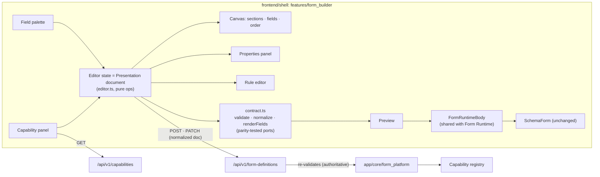

# Form Builder Platform (Form Platform Phase 3A)

**Status:** Phase 3A foundation. Readiness: `reviews/FORM_BUILDER_PHASE_3A_READINESS.md`
**Builds on:** `CAPABILITY_PLATFORM.md` (Phase 1), `FORM_DEFINITION_PLATFORM.md` (Phase 2 / 2.5)
**Code:** `frontend/shell/src/features/form_builder/`, routes in `src/pages/form_builder/`

> **FORM BUILDER CONFIGURES. CAPABILITY EXECUTES. DOMAIN VALIDATES. REPOSITORY PERSISTS. FORM RUNTIME RENDERS.**

## 1. Purpose and users

The Visual Form Builder is a configuration authoring tool. It lets an authorized consultant, implementation specialist, developer or business administrator produce a **Form Definition draft**: the presentation of one exact capability version's input. Ordinary end users never see it; they use the Form Runtime (`/forms/:formKey`).

It adds **no backend code**. Everything it does goes through two existing APIs:

| API | Used for |
|---|---|
| `GET /api/v1/capabilities` (Phase 2.5 discovery) | What can be bound, and each version's input JSON Schema |
| `/api/v1/form-definitions` (Phase 2) | List, read, create definition, create version (incl. `copy_from`), edit draft |

## 2. Architecture



| Layer | Owner |
|---|---|
| Server state: definition and versions, capability catalogue | TanStack Query (`builderKeys`); catalogue cached 5 min, fetched once per screen set |
| Editor state: the draft's presentation document, selection, tab | Local `useState` in `DraftEditor`. No global store. |
| Transformations | Pure functions in `editor.ts` and `contract.ts` (unit-tested) |
| Rendering | `@design` primitives, `SapTabs`, `FormRuntimeBody` → `SchemaForm` |

Screens: `/form-builder` (this tenant's forms), `/form-builder/new` (identity + exact capability version), `/form-builder/:formKey` (editor). The sidebar entry is shown only when the client knows the user holds `core.forms.design` (§9).

## 3. Capability discovery and version binding

- The capability panel lists the discovery payload as **Module › Resource › Action › Version**. Display names are humanized identifiers; the id itself is never altered. It shows only Phase 1 `describe()` metadata (display name, description, key, use permission, input contract name, the input fields and the raw JSON Schema). No class, ORM, table or route detail exists in the payload, and the Builder adds none (AST guard + E2E leak scan).
- A form is created bound to **one exact `(capability_id, capability_version)`**. The owner module is not typed in: it is the capability's module, as the Form Definition API requires.
- An existing draft shows its binding **pinned**. The editor never changes it, never "upgrades" it, and a new draft created from an immutable version (`copy_from`) keeps the same binding. Rebinding a draft to another version is supported by the API but deliberately not offered in Phase 3A.
- If the pinned version is no longer discoverable (module inactive, version disabled), editing is refused with an explanation. The Builder never guesses a replacement.

## 4. Editor model

**The editor state is the stored presentation document** (`Presentation` = backend `app/core/form_platform/presentation.py::Presentation`). There is no Builder schema and no Builder metadata is persisted.

```text
input schema + stored document ──deserialize (deep copy)──► editor state
editor state ──pure operations──► editor state
editor state ──validateAgainstContract──► { ok, normalized } ──PATCH──► server
```

- **Palette:** `contractFields(inputSchema)`. A field can be added only if it is a contract property the runtime can render (`text | number | date | select`). Unrenderable types (boolean, date-time, objects) are listed as unavailable. No custom fields.
- **New form:** every renderable contract field, in contract order, in one section. Always contract-valid.
- **Operations** (`editor.ts`): add, remove (also prunes the field from sections and rules), reorder within a section, assign to or remove from a section, update properties; add, rename, set columns (1–4), reorder and remove sections; add, update and remove rules. None of them branches on a field name.
- **Serialization** is the server's own normalization (`model_dump(exclude_none=True)`: explicit `readonly`/`hidden`/`columns`, no null keys). The Builder therefore sends exactly what the server stores. The round trip is lossless: `serialize(deserialize(stored)) == stored` (unit + E2E exact equality).
- **Validation order matters:** the raw editor state is validated, and only a passing validation's normalized document is sent. Normalizing first would silently drop an unknown property instead of rejecting it.

## 5. Presentation model (what the Builder can configure)

Exactly the contract's properties, nothing else:

| Element | Configurable |
|---|---|
| Field | `label`, `widget` (only those compatible with the contract type: text→text/select; number, date, select→themselves), `options` (select only; for a contract enum, chosen **from** the enum: a form may narrow and relabel, never invent values), `help`, `placeholder`, `readonly`, `hidden` |
| Section | `title`, `columns` 1–4, field membership and order |
| Rule | §6 |

Constraints that come from the contract are shown in the UI. For example, a required input without a default must stay visible and editable, so its Hidden and Read-only switches are disabled. Business semantics (balances, eligibility, approvals, postings) cannot be expressed: there is nowhere to put them.

## 6. Declarative rules

`WHEN [field] [operator] [value] THEN [action] [target fields]`

- Operators `eq, neq, in, not_in, empty, not_empty`; actions `show, hide, readonly`. These are closed lists in the UI and in validation.
- Values are typed by the condition field: options or enum values for selects, numbers for number fields, dates for date fields, comma-separated scalars for `in`/`not_in` on free fields.
- Changing an operator keeps the value shape valid (`withOperator`). Removing a field removes the rules that depend on it.
- Nothing is typed as an expression and nothing is executed (AST guard: no `eval`, `Function`, string timers or `innerHTML`). A smuggled operator, action or extra key is rejected by validation.
- Rules remain presentation. The capability re-validates every submission.

## 7. Preview

```text
editor state ─validateAgainstContract─► normalized ─renderFields─► render model ─► FormRuntimeBody ─► SchemaForm
```

- `renderFields` is the parity-tested port of the server's `render_fields`, so the model has the same shape `GET /form-runtime/{key}` returns.
- `FormRuntimeBody` is the **same component** the end-user runtime renders with (extracted from `FormRuntimeView` in this phase, behaviour unchanged). Rule evaluation is the same `rules.ts`.
- The preview holds throw-away local values. It imports no API client and has no submit control (AST guard). The E2E proves zero API calls while previewing.
- An invalid document shows a status instead of a preview.

## 8. Draft persistence, status and conflicts

| Situation | Behaviour |
|---|---|
| Latest version is a draft | Edit it. Save = PATCH `/form-definitions/{key}/versions/{n}` with the normalized document. |
| Latest version is review/published/archived | Immutable. Offer **New draft from vN** (`POST …/versions {copy_from}`). |
| No version yet (e.g. a previous attempt created only the definition) | Pick an exact version of the owner module's capabilities → create v1 |

**Save status:** `clean → dirty → saving → saved`, plus `error` (failed and still dirty) and `conflict` (`deriveSaveStatus`, unit-tested). While the editor is dirty, the browser's `beforeunload` prompt is armed and Close asks before discarding. The shell uses `BrowserRouter`, not a data router, so route-level blocking is not available; no global navigation system was added.

**Conflicts are never overwritten:**
1. Before writing, the Builder re-reads the version. If it is no longer a draft, or its document differs from what was loaded, that is a **conflict**: nothing is sent.
2. A server 409 is also a conflict.
3. A conflict freezes editing and offers **Reload from server**, after a discard confirmation. There is no automatic retry and no "save anyway".

The freshness check is a client-side read-then-write: it narrows, but cannot close, the window in which two designers saving the same draft at the same instant both succeed. Closing it needs a concurrency token on the draft PATCH, which is a Form Definition API change outside Phase 3A (readiness condition **C-3A-1**).

**Errors:** a 422's located errors are placed on the field, section or rule they concern, and the message is shown. 401, 403, 404 and 500 use the server's message or a specific fallback (the platform's global 404 handler returns no detail). A network failure says so.

## 9. Security boundary

| Concern | Mechanism |
|---|---|
| Authentication | The shell's existing session (`apiClient` attaches the token) |
| Authorization | **The server decides.** Discovery and every write require `core.forms.design`; reads require `core.forms.read`. The UI hides itself only when it *knows* the user lacks `core.forms.design`. The shell's auth store does not restore `user` after a reload (finding P3A-1), so permissions are often unknown client-side. The Builder then proceeds, and a 403 turns into the same "You cannot design forms" screen. |
| Tenant | No tenant field, selector or header anywhere in the Builder (AST guard). The server scopes every call to the caller's tenant. A body carrying `tenant_id` is rejected (422, closed request models). Another tenant's form is a 404 (E2E). |
| Execution | The Builder never calls `/form-runtime` or any business route, and the preview executes nothing (AST guard + E2E network log) |
| Audit | Unchanged. Every definition/version write the Builder makes is audited by the Form Definition service (`form.definition_created`, `form.version_created`, `form.version_edited`) and by `AuditMiddleware`. |

## 10. Relationship to the Form Runtime

A Builder-made form needs **nothing special** at runtime. After the existing lifecycle (submit → publish, over the existing API; there is no publishing UI in Phase 3A), the unchanged runtime renders it and executes its pinned capability. The E2E proves this on the real leave capability, including the rule, the sections and columns, and a persisted leave request.

## 11. Explicit non-goals (Phase 3A)

Not built, and not reachable from the Builder:
- publishing, review or archiving UI
- drag-and-drop (reordering is keyboard-operable buttons and selects; no dependency added)
- custom fields, computed fields, expressions or formulas
- workflow or approval design
- business logic, scripts, webhooks, HTTP actions
- table, ORM, API or code generation
- capability creation or editing
- import/export, transport, templates, marketplace, multi-language, analytics
- end-user form design
- renaming a form (there is no definition-update API: name and description are set at creation)
- legacy `metadata_engine`
