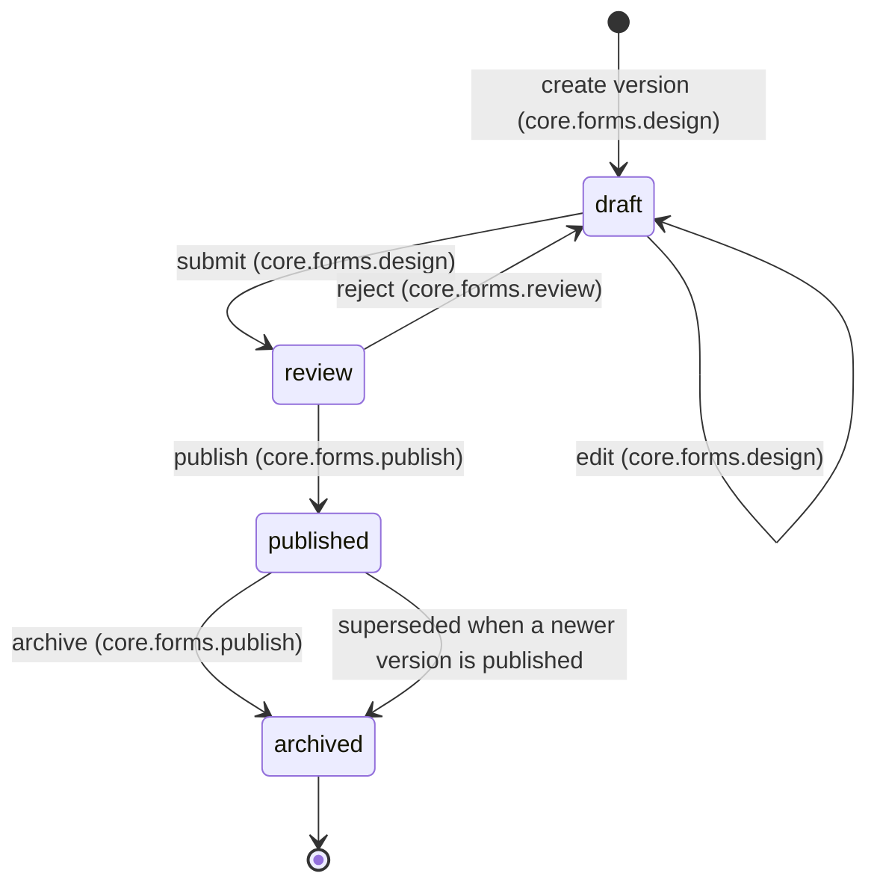
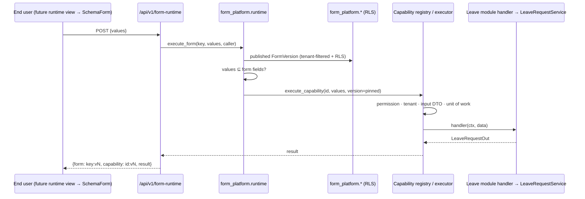
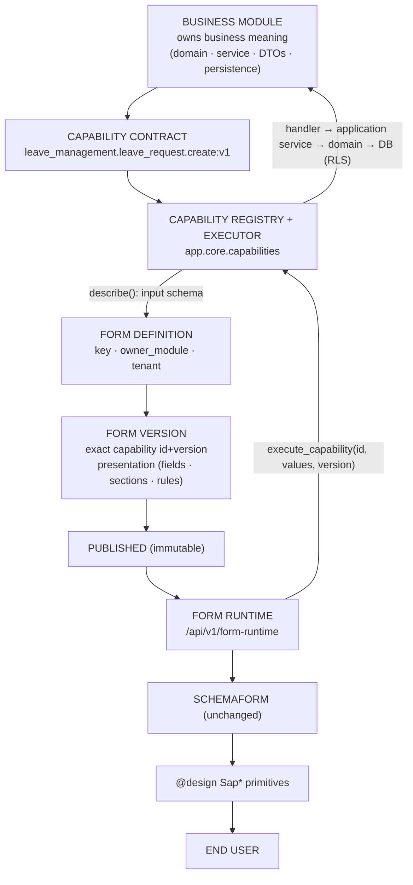

# Form Definition Platform

**Introduced by:** Form Platform Phase 2 — Form Definition & Versioning Foundation (2026-10-05)
**Code:** `backend/app/core/form_platform/` · HTTP `backend/app/api/v1/form_platform.py` · migration `backend/alembic/versions/c3d4e5f6a7b8_form_platform_definitions.py`
**Builds on:** [`CAPABILITY_PLATFORM.md`](CAPABILITY_PLATFORM.md) (Phase 1)
**Audit / readiness:** `reviews/FORM_DEFINITION_METADATA_AUDIT.md`, `reviews/FORM_DEFINITION_FOUNDATION_READINESS.md`

> **Form Definition configures HOW data is entered. Capability defines WHAT business operation is performed. Domain defines WHAT is valid. Persistence stores the resulting business state.**

---

## 1. Form Definition

A **Form Definition** is the stable, tenant-owned identity of a form:

| Field | Meaning |
|---|---|
| `key` | Stable identifier, `^[a-z][a-z0-9_]{2,99}$`, unique **per tenant** (e.g. `employee_leave_request`). It never changes when versions are added. |
| `name`, `description` | Display metadata |
| `owner_module` | The business module whose capabilities this form may bind to. A `leave_management` form can never bind a `sales` capability. |
| `tenant_id` | **NOT NULL.** Every form belongs to exactly one tenant (§6). |

A version is referenced as **`<key>:v<n>`**, e.g. `employee_leave_request:v1`. The capability it binds is referenced separately as `<capability id>:v<n>`.

It is **not** built on the legacy `app/core/metadata_engine` (`FormSchema` / `UiLayout`). The audit found no capability binding, no lifecycle, no immutability, coupling to tables via `MetaModel`, and NULL-means-global tenancy (audit §B–§F).

## 2. Form Version: immutable after publication

A **Form Version** holds everything needed to render and execute that version, and nothing else:

| Part | Content |
|---|---|
| **Capability binding** | `capability_id` + **exact** `capability_version` |
| **Presentation** | A validated JSON document: `fields[]`, `sections[]`, `rules[]` (§2.1) |
| **Lifecycle** | `status` plus who and when for each transition (`created/submitted/reviewed/published/archived_by/_at`, `review_comment`) |

**Why immutable:** a submitted business record must be reproducible. Knowing that a leave request came from `employee_leave_request:v3` has to mean the same fields, rules and business operation forever. So once a version leaves `draft`, its binding and presentation can never change. Evolution happens through **a new version** (`copy_from`), never by editing a published one.

Immutability is enforced **twice**:
1. **Service:** only `draft` versions are editable (HTTP 409 otherwise).
2. **PostgreSQL trigger `form_platform.form_versions_guard`:**
   - Executable content and identity are frozen once `status <> 'draft'`.
   - Only legal transitions are allowed.
   - New rows must start as `draft`.
   - Non-draft versions cannot be deleted.
   - The publication record is frozen.

   A mutation run that removed the service check showed the trigger alone stops the write.

### 2.1 Presentation document (closed schema, `extra="forbid"`)

```json
{
  "fields":   [{"name": "leave_type", "label": "Leave type", "widget": "select",
                "options": [{"value": "annual", "label": "Annual"}],
                "help": "…", "placeholder": "…", "readonly": false, "hidden": false}],
  "sections": [{"id": "period", "title": "Period", "columns": 2, "fields": ["leave_type", "start_date", "end_date"]}],
  "rules":    [{"when": {"field": "leave_type", "op": "eq", "value": "unpaid"},
                "then": {"action": "show", "fields": ["reason"]}}]
}
```

| Category (brief §17) | Phase 2 |
|---|---|
| **Domain field** | ✅ Every field must be a property of the bound capability's input contract. The form configures presentation only. |
| **Custom field** | ✗ **Rejected** ("not part of the capability input contract"). The capability would never persist it. This needs a module-owned extension contract (future). |
| **Computed field** | ✗ Not in Phase 2. A presentation-only computation needs a safe declarative expression model (future). Anything affecting business state belongs in the module. |

Validation against the contract (`presentation.validate_against_contract`):
- A required input with no default must be on the form, visible and editable, and no rule may hide it or make it readonly.
- Widgets ∈ `text | number | date | select`, which is **exactly** SchemaForm's `FieldKind`. A cross-stack test parses `SchemaForm.tsx`. Each widget must also suit the field's contract type: a `text` field may be shown as `select` with form-supplied options, and enum options must be a subset of the contract's allowed values.
- Sections must reference real fields, each at most once, and place every visible field.
- **Rules** are data: operators `eq | neq | in | not_in | empty | not_empty`, actions `show | hide | readonly`, and values are JSON scalars or lists. There is no expression language, no code, no SQL, no service/class/route/table name. A string that "looks like code" is just a value compared by equality. Reference semantics live in `presentation.evaluate_rules`, which any future frontend runtime must match.
- **Form UX checks are never authoritative.** For example, `end_date ≥ start_date` and *leave balance ≥ requested days* stay in the Leave module, and every submission is re-validated by the capability.

## 3. Capability binding: why a form binds to a capability, not a service

```text
✅ employee_leave_request:v1 ──► leave_management.leave_request.create:v1
✗  LeaveRequestService.create_request · POST /leave-management/requests · leave_management.leave_requests · a Python import path
```

- The binding is two plain values `(capability_id, capability_version)`, resolved only through the Phase 1 registry's dict lookup. Configuration can never name a class, route or table.
- **Exact version:** a form version stays bound to the capability version it was published with. If `…create:v2` appears, `employee_leave_request:v1` keeps executing `…create:v1`. Only a new form version that explicitly binds v2 uses it. This is proven by `test_form_versions_stay_pinned_to_their_exact_capability_version`; a mutation that resolved the latest version made that test fail.
- **Binding checks:**
  - Unknown id or version → 422.
  - Capability of another module → 422.
  - `disabled` → 422.
  - `deprecated` → may be drafted, never **published**.
  - At publish, the binding and presentation are re-validated against the **live** registry.
- **Fail-closed:** if the owning module is deactivated, its capabilities are withdrawn (Phase 1) and its published forms return 404 at runtime until it is re-activated.

## 4. Lifecycle



- **At most one `published` version per form.** A partial unique index enforces it, and publishing a new version archives the previous one in the same transaction (supersede).
- **`archived` is terminal.** There is no `archived → published`. To bring a form back, create a new draft with `copy_from` and publish it, which records an explicit, audited decision.
- Separation of duties (for example, the submitter may not publish their own version) is **not** enforced in Phase 2. Permissions are separable, but one user may hold all of them.

## 5. Runtime: resolution and execution

```text
GET  /api/v1/form-runtime/{key}[?version=n]   →  render model
POST /api/v1/form-runtime/{key}  {values, version?}  →  {form, capability, result}
```

**Deterministic resolution:**
- The form key resolves to the **single published version**.
- An explicitly pinned `version=n` must *still* be published, otherwise 409. A client that rendered v1 cannot silently submit into v2.
- The version resolves to its exact capability `id:vN`, then to `capability_registry.resolve(id, N)` and its input JSON Schema.

**Render model:** `fields[]` in **SchemaForm `FieldSpec` shape** (`name`, `label`, `kind`, `required`, `maxLength`, `options`, `hint`, `placeholder`, plus `readonly` / `hidden` / `default`), along with `sections[]`, `rules[]`, the form ref and the capability ref.

**Execution:** first, only fields the version presents may be submitted (others → 422). Then `execute_capability(id, values, caller, version=N)` runs. From there Phase 1 takes over: authorization, tenant, input DTO validation, unit of work, the module handler, `LeaveRequestService`, the domain and PostgreSQL with RLS.

**Generic:** the platform has no `if form_key == …`, `if field == …` or `if module == …`. This is AST-checked: no business-word string literal appears in executable code of `app/core/form_platform`.



## 6. Security: tenant, permission, audit

| Concern | Mechanism (all reused) |
|---|---|
| **Tenant scope** | **TENANT.** `tenant_id NOT NULL` on both tables, so form config never falls into the RLS `tenant_id IS NULL → global` branch (audit F-5). Global or module-provided templates are future scope. |
| Tenant source | `caller.tenant_id` (JWT `tid`) only. The service **refuses** a caller whose tenant differs from the tenant bound to the DB session, and refuses to run under a tenant bypass. |
| Layer 1 | Every query filters by `tenant_id` |
| Layer 2 | PostgreSQL RLS, enabled and **forced**, using the shared policy via `rls.enable_statements`. Proven independently: with the service filter removed (mutation), tenant isolation still held. |
| Cross-tenant | Another tenant's form is indistinguishable from a missing one (404) for read, edit, version, publish, archive, render and execute |
| **Permissions** | Ordinary `core.*` platform codes, granted through the existing role/permission tables and checked by `require_permission` / `UserContext.has_permission` → `RBACEngine`. `core.forms.read` lists and views. `core.forms.design` creates, edits drafts and submits. `core.forms.review` rejects. `core.forms.publish` publishes and archives. **Using a form needs no form permission:** it requires the bound capability's own permission, so "can use the form" equals "can perform the business operation". |
| **Audit** | `AuditService.record` in the **same transaction** as each lifecycle change: `form.definition_created`, `form.version_created`, `form.version_edited`, `form.submitted`, `form.rejected`, `form.published` (+ superseded versions), `form.archived`. `new_values` records the form key, version, status, **capability id and version**, and the actor and timestamp. HTTP writes are additionally recorded by `AuditMiddleware`. The capability execution itself is logged by the Phase 1 executor. |

## 7. Relationship to SchemaForm

```text
Published Form Version ──► capability input JSON Schema ──► render model (FieldSpec[])
                                                              │
                                                              ▼
                                        future runtime view (sections / rules / submit)
                                                              │
                                                              ▼
                                        SchemaForm (frontend/shell/src/components/form)
                                                              │
                                                              ▼
                                        @design primitives (SapInput / SapNumberInput / SapSelect)
```

- **SchemaForm is unchanged and does not know the Form Platform** (AST/source test).
- The backend widget set is **exactly** SchemaForm's `FieldKind` (cross-stack test), so every publishable form is renderable without touching SchemaForm.
- The UI primitives are this repo's `@design` `Sap*` components. The brief's "shadcn/ui" corresponds to that layer here.
- Phase 2 adds **no frontend code**: no runtime page and no builder. The future runtime view composes `SchemaForm` per section and applies `evaluate_rules` semantics.

## 8. Relationship to Workflow

The Form Platform and the Workflow Platform are **separate platform capabilities**. `app.core.form_platform` imports neither `app.core.workflow` nor `app.core.application_flow` (AST-enforced). A form may bind a capability whose implementation starts a workflow (for example, a future `…leave_request.submit`), but the form never orchestrates. The long-term direction, "Workflow/Flow Action → capability", is tracked as Phase 1 debt R-10a, and Phase 2 neither builds nor depends on it.

## 9. Relationship to Business Modules

Business modules remain authoritative. They own domain semantics, DTOs, services, persistence and the capabilities they publish. The Form Platform stores **configuration only**: two tables, no per-form tables, no per-field columns, no migrations generated from forms, no business writes. Every business write happens inside the module, reached through its capability.

## 10. Architecture diagram

Arrows show flow. Import dependencies point **toward** the platforms: modules import `app.core.capabilities`, and `app.core.form_platform` imports `app.core.capabilities`. Neither platform imports a module.



## 11. Boundary rules

**Form Platform MAY:** store form definitions and versions, bind forms to capabilities (exact version), configure presentation and safe declarative rules, expose runtime schemas, and resolve published forms.

**Form Platform MUST NOT:** own business rules, write business tables, invoke arbitrary Python or services by string, bypass capability contracts, bypass permissions or tenant isolation, generate tables or migrations, or become a code-execution engine. Enforced by `tests/unit/test_form_platform_architecture.py`:
- imports are allowlisted
- no `metadata_engine`, `workflow`, `application_flow`, modules or FastAPI
- no `getattr` / `setattr` / `eval` / `exec` / dynamic import
- no business-name literals in executable code

**Business Modules MAY:** define domain semantics, business rules, application services and contracts; expose capabilities; own persistence.
